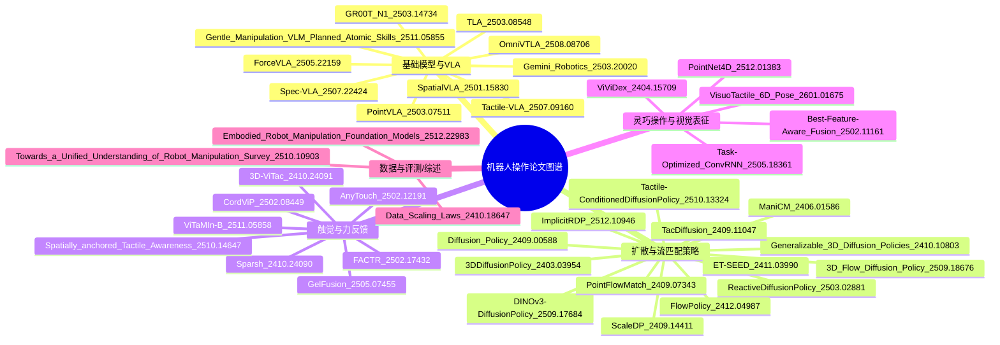

# 论文图谱

## 研究方向图谱（Mindmap）



## 问题图谱（研究问题归纳）

| 论文 | 研究方向 / 核心问题 |
|---|---|
| ForceVLA_2505.22159 | 将力/力矩作为一级模态融入 VLA，提升接触丰富操控 |
| PointVLA_2503.07511 | 不重训 VLA 的前提下注入点云 3D 信息 |
| SpatialVLA_2501.15830 | 设计 3D 空间表征（Ego3D 与动作网格）增强 VLA |
| Spec-VLA_2507.22424 | 推测解码在 VLA 中的加速策略与接受准则 |
| GR00T_N1_2503.14734 | 人形机器人基础模型的多源数据与双系统架构 |
| Gemini_Robotics_2503.20020 | 具身推理+VLA 控制的通用机器人模型 |
| OmniVTLA_2508.08706 | 多模态 VLA 在通用任务上的统一架构 |
| Tactile-VLA_2507.09160 | 触觉-视觉-语言融合的 VLA 控制 |
| TLA_2503.08548 | 触觉-语言-动作三模态统一建模 |
| Gentle_Manipulation_VLM_Planned_Atomic_Skills_2511.05855 | VLM 规划原子技能的轻柔操控学习 |
| Diffusion_Policy_2409.00588 | 扩散策略的优化与动作分布建模 |
| 3DDiffusionPolicy_2403.03954 | 3D 表征下扩散策略的泛化操控 |
| Generalizable_3D_Diffusion_Policies_2410.10803 | 3D 扩散策略的跨任务泛化能力 |
| TacDiffusion_2409.11047 | 力域扩散生成 6D wrench 的高精度插入 |
| ReactiveDiffusionPolicy_2503.02881 | 视觉-触觉慢-快层级扩散策略 |
| Tactile-ConditionedDiffusionPolicy_2510.13324 | 触觉条件下扩散策略学习 |
| DINOv3-DiffusionPolicy_2509.17684 | 视觉表征增强的扩散策略 |
| 3D_Flow_Diffusion_Policy_2509.18676 | 流匹配/流模型驱动的 3D 操控策略 |
| FlowPolicy_2412.04987 | 一致性流匹配实现单步策略生成 |
| PointFlowMatch_2409.07343 | 点云条件的流匹配模仿学习 |
| ET-SEED_2411.03990 | 轨迹级 SE(3) 等变扩散策略与数据效率 |
| ScaleDP_2409.14411 | 扩散 Transformer 的可扩展性与规模化训练 |
| ManiCM_2406.01586 | 一致性模型实现实时 3D 扩散策略 |
| ImplicitRDP_2512.10946 | 反应式扩散策略的隐式建模 |
| FACTR_2502.17432 | 力反馈驱动的课程式训练与遥操作采集 |
| CordViP_2502.08449 | 手-物体对应关系与交互感知点云 |
| 3D-ViTac_2410.24091 | 视觉-触觉点云融合的精细操控 |
| Sparsh_2410.24090 | 触觉表征的通用化学习 |
| GelFusion_2505.07455 | 视觉受限下的视触融合操控 |
| ViTaMIn-B_2511.05858 | 视触双手操控接口与示教 |
| AnyTouch_2502.12191 | 触觉驱动的操作策略与泛化 |
| Spatially_anchored_Tactile_Awareness_2510.14647 | 空间锚定触觉表征的鲁棒操控 |
| ViViDex_2404.15709 | 由人类视频学习灵巧操作的视觉策略 |
| PointNet4D_2512.01383 | 4D 点云视频骨干与在线感知 |
| Best-Feature-Aware_Fusion_2502.11161 | 多视角特征融合的精细操控 |
| Task-Optimized_ConvRNN_2505.18361 | 任务优化的时序视觉表征 |
| VisuoTactile_6D_Pose_2601.01675 | 视触融合的手内物体 6D 位姿估计 |
| Data_Scaling_Laws_2410.18647 | 模仿学习的数据规模定律 |
| Towards_a_Unified_Understanding_of_Robot_Manipulation_Survey_2510.10903 | 机器人操作统一综述 |
| Embodied_Robot_Manipulation_Foundation_Models_2512.22983 | 基础模型时代的机器人操作综述 |
```
